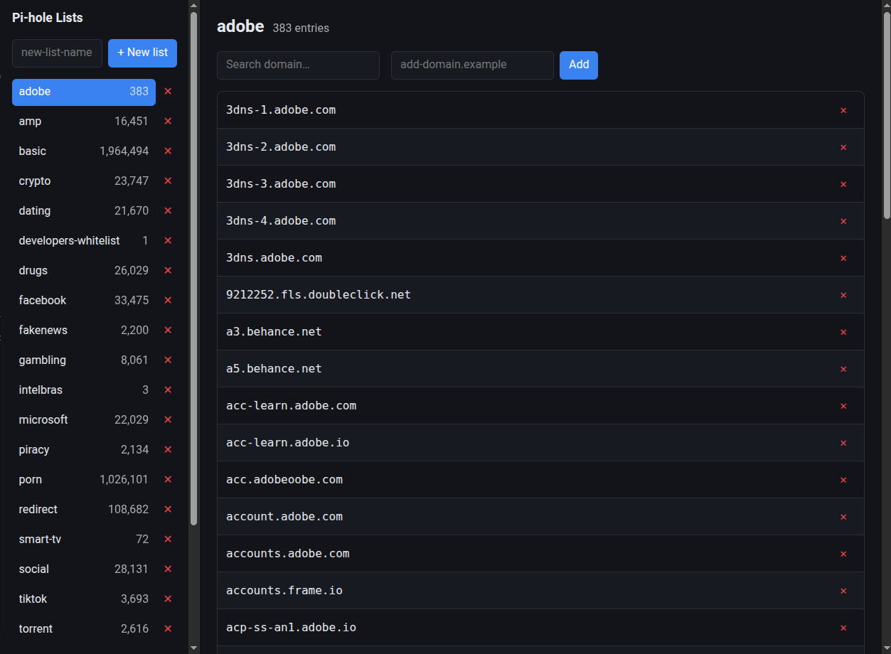

# Pi-Hole Lists | Adlists

[](https://github.com/dcotecnologia/pihole-lists/actions/workflows/tests.yml)

Simplified adlists to complete your local dns server. You will need a software like [Pi-Hole](https://github.com/pi-hole/pi-hole).

> **Recommended:** [`basic.txt`](https://raw.githubusercontent.com/dcotecnologia/pihole-lists/master/lists/basic.txt) — a starter list that contains malicious, spam, phishing, ads, malware and tracking hosts.

## Community

I strongly recommend that you import and keep these lists as an add-on. Don't worry, Pi-hole will merge all your imported lists.

```json
{
    "openphish": "https://raw.githubusercontent.com/openphish/public_feed/refs/heads/main/feed.txt",
    "Spam404": "https://raw.githubusercontent.com/Spam404/lists/refs/heads/master/main-blacklist.txt",
    "stevenblack": "https://raw.githubusercontent.com/StevenBlack/hosts/master/hosts",
    "someonewhocares": "https://someonewhocares.org/hosts/hosts",
    "yoyo": "https://pgl.yoyo.org/adservers/serverlist.php?hostformat=hosts&mimetype=plaintext&useip=0.0.0.0",
    "adaway": "https://raw.githubusercontent.com/AdAway/adaway.github.io/master/hosts.txt",
    "nolovia": "https://raw.githubusercontent.com/parseword/nolovia/master/skel/hosts-windows-telemetry.txt"
}
```

## Ready-to-use list

| List                 | Link                                                                                                                           | Description                                                        |
| -------------------- | ------------------------------------------------------------------------------------------------------------------------------ | ------------------------------------------------------------------ |
| adobe                | [adobe.txt](https://raw.githubusercontent.com/dcotecnologia/pihole-lists/master/lists/adobe.txt)                               | Adobe telemetry                                                    |
| amp                  | [amp.txt](https://raw.githubusercontent.com/dcotecnologia/pihole-lists/master/lists/amp.txt)                                   | Block AMP pages with this list                                     |
| crypto               | [crypto.txt](https://raw.githubusercontent.com/dcotecnologia/pihole-lists/master/lists/crypto.txt)                             | Crypto / cryptojacking based sites                                 |
| dating               | [dating.txt](https://raw.githubusercontent.com/dcotecnologia/pihole-lists/master/lists/dating.txt)                             | Known sites about dating                                           |
| developers-whitelist | [developers-whitelist.txt](https://raw.githubusercontent.com/dcotecnologia/pihole-lists/master/lists/developers-whitelist.txt) | Allowlist for developer-tooling hosts that should never be blocked |
| drugs                | [drugs.txt](https://raw.githubusercontent.com/dcotecnologia/pihole-lists/master/lists/drugs.txt)                               | Sites that deal with illegal drugs                                 |
| facebook             | [facebook.txt](https://raw.githubusercontent.com/dcotecnologia/pihole-lists/master/lists/facebook.txt)                         | Block Facebook and Facebook-related/owned services                 |
| fakenews             | [fakenews.txt](https://raw.githubusercontent.com/dcotecnologia/pihole-lists/master/lists/fakenews.txt)                         | Known sites that promote fake news                                 |
| gambling             | [gambling.txt](https://raw.githubusercontent.com/dcotecnologia/pihole-lists/master/lists/gambling.txt)                         | All gambling-based sites, legit and illegal                        |
| intelbras            | [intelbras.txt](https://raw.githubusercontent.com/dcotecnologia/pihole-lists/master/lists/intelbras.txt)                       | Intelbras service and event tracking                               |
| microsoft            | [microsoft.txt](https://raw.githubusercontent.com/dcotecnologia/pihole-lists/master/lists/microsoft.txt)                       | General Microsoft-related hosts                                    |
| piracy               | [piracy.txt](https://raw.githubusercontent.com/dcotecnologia/pihole-lists/master/lists/piracy.txt)                             | Known sites that allow illegal downloads                           |
| porn                 | [porn.txt](https://raw.githubusercontent.com/dcotecnologia/pihole-lists/master/lists/porn.txt)                                 | Porn or sites that promote porn                                    |
| redirect             | [redirect.txt](https://raw.githubusercontent.com/dcotecnologia/pihole-lists/master/lists/redirect.txt)                         | Sites that redirect you away from your intended site               |
| smart-tv             | [smart-tv.txt](https://raw.githubusercontent.com/dcotecnologia/pihole-lists/master/lists/smart-tv.txt)                         | Smart TV call-home and ads                                         |
| social               | [social.txt](https://raw.githubusercontent.com/dcotecnologia/pihole-lists/master/lists/social.txt)                             | All the most popular social networks                               |
| tiktok               | [tiktok.txt](https://raw.githubusercontent.com/dcotecnologia/pihole-lists/master/lists/tiktok.txt)                             | Blocks TikTok                                                      |
| torrent              | [torrent.txt](https://raw.githubusercontent.com/dcotecnologia/pihole-lists/master/lists/torrent.txt)                           | Torrent trackers and directories                                   |
| tracking             | [tracking.txt](https://raw.githubusercontent.com/dcotecnologia/pihole-lists/master/lists/tracking.txt)                         | General analytics and tracking hosts                               |
| vaping               | [vaping.txt](https://raw.githubusercontent.com/dcotecnologia/pihole-lists/master/lists/vaping.txt)                             | User-requested list that blocks sites promoting vaping             |
| whatsapp             | [whatsapp.txt](https://raw.githubusercontent.com/dcotecnologia/pihole-lists/master/lists/whatsapp.txt)                         | User-requested list that blocks only WhatsApp                      |
| x                    | [x.txt](https://raw.githubusercontent.com/dcotecnologia/pihole-lists/master/lists/x.txt)                                       | User-requested list that blocks only X / Twitter                   |
| youtube              | [youtube.txt](https://raw.githubusercontent.com/dcotecnologia/pihole-lists/master/lists/youtube.txt)                           | User-requested list that blocks only YouTube                       |

## External lists

| List            | Link                                                                                                                                |
| --------------- | ----------------------------------------------------------------------------------------------------------------------------------- |
| Adaway          | [adaway_hosts.txt](https://raw.githubusercontent.com/dcotecnologia/pihole-lists/master/imported/adaway_hosts.txt)                   |
| Nolovia         | [nolovia_hosts.txt](https://raw.githubusercontent.com/dcotecnologia/pihole-lists/master/imported/nolovia_hosts.txt)                 |
| Openphish       | [openphish_hosts.txt](https://raw.githubusercontent.com/dcotecnologia/pihole-lists/master/imported/openphish_hosts.txt)             |
| Someonewhocares | [someonewhocares_hosts.txt](https://raw.githubusercontent.com/dcotecnologia/pihole-lists/master/imported/someonewhocares_hosts.txt) |
| Spam404         | [Spam404_hosts.txt](https://raw.githubusercontent.com/dcotecnologia/pihole-lists/master/imported/Spam404_hosts.txt)                 |
| stevenblack     | [stevenblack_hosts.txt](https://raw.githubusercontent.com/dcotecnologia/pihole-lists/master/imported/stevenblack_hosts.txt)         |
| yoyo            | [yoyo_hosts.txt](https://raw.githubusercontent.com/dcotecnologia/pihole-lists/master/imported/yoyo_hosts.txt)                       |

## How to generate a compiled list

Install dependencies and combine the curated lists in `lists/` into every possible
combination under `src/out/`:

```sh
uv sync
make compile
```

Restrict which lists are combined with the `LISTS` env var:

```sh
LISTS=porn,ads_malware make compile
```

Leave `LISTS` unset to combine every list in `lists/`.

To clean up the lists (dedupe entries and drop invalid domains), either run it locally:

```sh
make cleanup
```

or inside Docker, without a local Python/uv setup:

```sh
docker-compose build
docker-compose run cleanup
```

## Web UI (local list management)

A local API + web UI let you list, add, and remove lists and entries in
`lists/` without touching the files by hand:

```sh
docker compose up api web
```

- API (FastAPI): <http://localhost:8000> (docs at `/docs`)
- Web (Vue): <http://localhost:8098>



Both run with hot reload out of the box - editing `webapp/api/app/` or
`webapp/web/src/` picks up live, no rebuild needed. This is a local admin
tool only: there's no authentication, so don't expose these ports beyond
your own machine/LAN. See `webapp/api/README.md`/`webapp/web/README.md` for
details.

## How to contribute to the project

Fork it. Open your own PR with the hosts added and some explanation about why are they being added for us to review. If you are not used to edit these files, just open an issue an we are gonna update ASAP.

**Please do not directly email any committers with questions or problems.** A community is best served when discussions are held in public.

Searching the [issues](https://github.com/dcotecnologia/pihole-lists/issues) for your problem is also a good idea.

## Contributing

- Check out the latest master to make sure the feature hasn't been implemented or the bug hasn't been fixed yet;
- Check out the issue tracker to make sure someone hasn't already requested it and/or contributed it;
- Fork the project;
- Start a feature/bugfix branch;
- Commit and push until you are happy with your contribution;
- Make sure to add tests for it. This is important so I don't break it in a future version unintentionally.;
- Please try not to mess with the Rakefile, version, or history. If you want to have your own version, or is otherwise necessary, that is fine, but please isolate to its own commit so I can cherry-pick around it.

## License

Please see [LICENSE](LICENSE) for licensing details.

## Sources

The main source is [Blocklist Project](https://github.com/blocklistproject/Lists), [License](https://github.com/blocklistproject/Lists/blob/master/LICENSE).

## Maintainers

Danilo Carolino, [@danilogco](https://github.com/danilogco)
